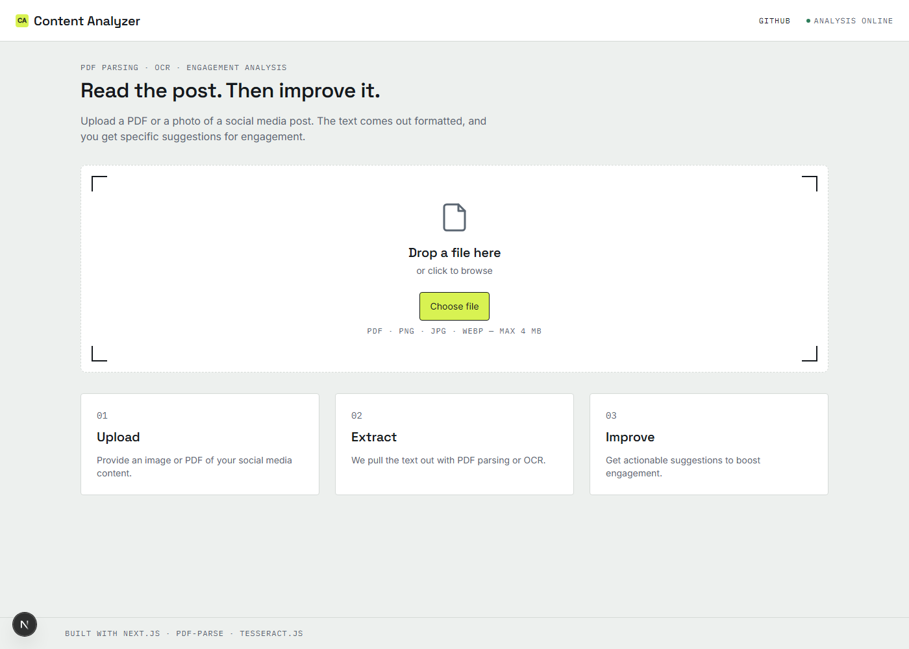
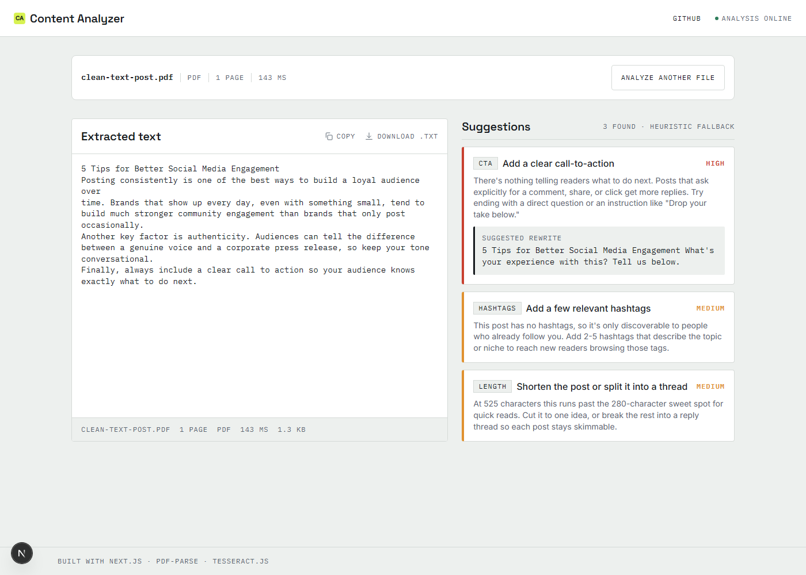

# Social Media Content Analyzer

Upload a PDF or a photo of a social media post; get the text back cleanly formatted,
plus concrete suggestions for improving engagement.

**Live:** https://social-media-analyser-tau.vercel.app
**Repo:** https://github.com/mucool-codes/Social_media_analyser

<p align="center">
  
  
</p>

## Features

| Brief requirement | Implementation |
|---|---|
| Accept PDF/image upload | Drag-and-drop or click-to-browse (`react-dropzone`), one file at a time, 4 MB cap enforced client-side before the request is even made |
| PDF text extraction | `pdf-parse` (Node) behind `POST /api/extract`, with page count and per-page text |
| OCR for images | `tesseract.js` in a Web Worker, entirely client-side, live progress reporting |
| Formatting preserved | Shared `normalizeText` pass: line endings, ligatures, smart quotes, de-hyphenation, repeated header/footer stripping, whitespace cleanup — applied identically to both extraction paths |
| Engagement suggestions | `POST /api/analyze`: Gemini-generated suggestions when available, rule-based heuristics otherwise — see [Design decisions](#design-decisions--trade-offs) |
| Error handling | Every failure (bad file type, empty file, too many pages, password-protected PDF, no extractable text, LLM failure, rate limit, network error) maps to a specific `ApiErrorCode` and a plain-language message with a recovery action — never a raw exception |
| Loading states | Multi-stage progress panel (Uploaded → Extracting → Analyzing) with real OCR progress (%), not a fake spinner; a skeleton placeholder for the text panel while waiting |

## Architecture

```
                         ┌─────────────────────────┐
  PDF  ─────────────────▶│  POST /api/extract       │  Node runtime
                         │  pdf-parse                │
                         └────────────┬─────────────┘
                                      │
  Image ──▶ Tesseract.js (in-browser,│ normalizeText()
            Web Worker, no upload)   │
                    │                 │
                    └────────┬────────┘
                             ▼
                    ExtractedDoc (shared shape)
                             │
                             ▼
                    ┌─────────────────────┐
                    │  POST /api/analyze    │  text in, never the file
                    │  Gemini ─▶ or heuristics on failure/timeout/missing key │
                    └─────────────────────┘
                             │
                             ▼
                     AnalysisResult → UI
```

PDFs are parsed server-side because `pdf-parse` needs Node's `fs`/WASM; images are OCR'd
entirely in the browser because the Tesseract worker payload (~10 MB) and recognition
time don't fit Vercel's serverless constraints. Both paths converge on the same
`ExtractedDoc` shape before analysis, so the UI has exactly one rendering path
regardless of source. Extraction and analysis are two separate endpoints — analysis
never blocks extraction, and extraction never depends on the LLM being configured or
reachable.

## Tech stack

| Technology | Why |
|---|---|
| Next.js 15 (App Router) | Frontend and API routes in one deployable unit, first-class Vercel support |
| TypeScript (strict) | A frozen shared contract (`src/lib/types.ts`) between extraction, analysis, and UI, checked at compile time |
| Tailwind CSS | Utility styling fast enough to match the design reference without a component library |
| react-dropzone | Accessible drag-and-drop with built-in rejection handling, instead of hand-rolling drag events |
| pdf-parse | Node-native PDF text + page extraction (wraps `pdfjs-dist`) |
| Tesseract.js | WASM OCR that runs fully in-browser — no image ever leaves the client |
| Gemini (`gemini-3.6-flash`, free tier) | LLM-generated suggestions when a key is configured; optional by design |
| Zod | Validates and safely parses Gemini's JSON output before trusting it |
| Vitest | Fast, Vite-native test runner with a jsdom environment for component tests |
| Vercel | Zero-config Next.js hosting; its Hobby-tier limits (4.5 MB body, 10s functions) shaped several design decisions above |

## Local setup

```bash
git clone https://github.com/mucool-codes/Social_media_analyser.git
cd Social_media_analyser
npm install --legacy-peer-deps   # plain `npm install` crashes on npm@10.9.2 in this repo
cp .env.example .env.local       # optional — see below
npm run dev                      # http://localhost:3000
```

**No API key required to run it.** `GEMINI_API_KEY` in `.env.local` is optional — leave
it unset and `/api/analyze` transparently falls back to rule-based heuristic
suggestions instead of failing. Uploading is fully functional either way; you should be
looking at a working upload → extract → analyze flow within about a minute of cloning.

## Testing

```bash
npm test              # vitest run — 140 tests, 15 files
npm run test:watch    # watch mode
```

Covers: PDF extraction against real generated PDF fixtures (`tests/extract/`, including
password-protected and over-the-page-limit rejection), the `normalizeText` formatting
rules, OCR confidence/warning/progress/cleanup behavior, heuristic suggestion generation
and Flesch reading-ease scoring, Gemini response parsing (valid JSON, malformed JSON,
prose-wrapped JSON) and its fallback path, both API routes end-to-end, magic-byte file
sniffing, the `useAnalyzer` state machine (including stale-response and double-click
guards), and component-level drag/drop/reject behavior. Statement coverage is ~93%
(`npm test -- --coverage`).

## Project structure

```
src/
  app/
    api/extract/route.ts     PDF extraction endpoint (Node runtime)
    api/analyze/route.ts     Analysis endpoint (Gemini + heuristic fallback)
    page.tsx, layout.tsx     App shell
  components/                UI, split from the state machine that drives them
    ui/                      Design-system primitives (Button, icons, tokens)
  lib/
    types.ts                 Frozen contract: ApiResponse, ExtractedDoc, AnalysisResult
    http.ts                  ok()/fail() response builders, error-to-status mapping, logger
    validation.ts             File metadata + magic-byte checks (shared client/server)
    config.ts                Limits, CDN paths, server-only Gemini key accessor
    extract/                 pdf.ts (server), ocr.ts (client), format.ts (shared normalizeText)
    analyze/                 heuristics.ts, llm.ts, prompt.ts, schema.ts
    client/                  apiClient.ts, useAnalyzer.ts (state machine), formatting helpers
tests/                       Mirrors src/, plus generated PDF fixtures
sample-data/                 Sample PDFs for manual testing, see sample-data/README.md
docs/                        APPROACH.md, ARCHITECTURE.md, screenshots
```

## Design decisions & trade-offs

- **Two extraction runtimes, one contract.** Rather than route everything through the
  server, images are OCR'd client-side and PDFs server-side, purely because of where
  each library needs to run. Both return `ExtractedDoc`, so this split is invisible to
  the UI and to `/api/analyze`.
- **Formatting is preserved, not reconstructed.** `normalizeText` fixes encoding
  artifacts and strips genuinely repeated headers/footers (a line recurring as the
  first/last line of 3+ pages), but it does not attempt layout reconstruction. It's a
  proxy heuristic, not a page-layout parser — see [Known limitations](#known-limitations).
- **Analysis degrades, it doesn't fail.** `/api/analyze` always returns a usable result:
  no key configured, a Gemini timeout, a rate limit, or two consecutive malformed JSON
  responses all fall through to `heuristicSuggestions` — a real rule-based engine (CTA
  presence, hashtag count, hook strength, all-caps, length, missing line breaks, link
  context), not a placeholder. When Gemini returns fewer than 3 suggestions,
  non-duplicate heuristic ones are merged in rather than shown as a short list.
- **Validation happens twice.** `validateFileMeta` runs client-side before upload (fast
  feedback, saves a round trip) and again server-side on the received bytes, because the
  client can't be trusted. The server additionally sniffs magic bytes rather than
  trusting `file.type`, which is spoofable.
- **A request-sequence ref, not just component state, guards the async chain.**
  `useAnalyzer` increments a ref on every new file selection or reset; extraction and
  analysis callbacks check it before dispatching, so a slow response for a file the user
  already replaced can't clobber the current view. A second `analysisInFlight` ref
  additionally blocks a same-tick double-click on retry, which the sequence check alone
  doesn't prevent.
- **The rate limiter is intentionally minimal.** `/api/analyze`'s per-IP limiter (10
  req/min) is in-memory — it resets on cold start and doesn't share state across
  serverless instances. Adequate for this project's scale; a real deployment under
  multi-instance traffic would need a shared store (Redis or similar).

## Known limitations

- **PDF extraction is not layout-aware.** A multi-column PDF extracts in
  content-stream order (left column in full, then right), not visual reading order —
  `pdf-parse`/`pdfjs-dist` has no notion of visual layout. See
  `sample-data/multi-column-newsletter.pdf` for a concrete example.
- **Header/footer stripping is a heuristic**, not a layout parser: it looks at each
  page's first/last non-blank line and drops one that recurs identically across 3+
  pages. A one-line page that matches both a recurring header and footer is
  de-duplicated once, not twice.
- **OCR is English-only** (`tesseract.js` loaded with the `eng` trained data only).
- **The per-IP rate limiter is in-memory**, not distributed — see above.
- **The Gemini model name is hardcoded** (`gemini-3.6-flash`). Google periodically
  retires older models with no advance API-detectable signal; this already happened once
  during development (`gemini-2.0-flash` was retired mid-project). The heuristic
  fallback is what keeps the app working when that happens again, but the model name
  itself needs a manual update.
- **Nothing is persisted.** Each upload is a one-off request/response; there's no
  history, accounts, or saved results.
- **No automated test exercises a real encrypted PDF** (the password-protected-PDF path
  is covered via a mocked `PasswordException`, not a real encrypted fixture) — see
  `sample-data/README.md` for why.

## Time spent (approximate, against an 8-hour budget)

| Area | Time |
|---|---|
| Foundation: scaffold, shared contracts, project setup | ~0.5h |
| Extraction: PDF parsing, OCR, text normalization, tests | ~1h |
| Analysis: Gemini integration, heuristic engine, schema validation, tests | ~1h |
| Frontend: UI from design reference, state machine, tests | ~1.5h |
| Hardening: edge cases (multi-file drop, double-click, worker bundling), test coverage pass | ~1.5h |
| Post-hardening fixes: Gemini fallback logging, stale model name | ~0.5h |
| Documentation (this session): README, ARCHITECTURE.md, APPROACH.md, deployment verification | ~1h |
| **Total** | **~7h**, ~1h under budget |

## Deployment verification

Verified against the live URL above (not just `localhost` — Tesseract's CDN worker
paths and `pdf-parse`'s bundling have both broken in production-only ways for this
stack even when `npm run build` passes locally):

- **PDF extraction**, both via the UI and a direct `curl -F file=@...` to
  `/api/extract`, against two different sample PDFs — correct text, page count, and
  duration back each time.
- **OCR extraction**, via the UI, against a real rendered image (no scanned-image
  fixture ships in `sample-data/`, see its README) — 94% confidence, correct text, no
  low-confidence warning misfire.
- **No Tesseract worker 404s, no `pdf-parse` errors, and no browser console errors**
  across either flow (checked via full request/response and console monitoring, not
  just visual inspection).
- **Gemini path confirmed live**, not just the heuristic fallback: the suggestions
  panel showed `GEMINI-3.6-FLASH` with genuinely LLM-generated suggestions (e.g.
  catching that the sample post's headline promised "five tips" but only listed three —
  not something the rule-based heuristics check for). This was the thing to double-check
  given `gemini-2.0-flash` broke here once already — confirmed fixed, not assumed.
  4 direct calls to `/api/analyze` returned `gemini-3.6-flash` 3 times and
  `heuristic-fallback` once; the one fallback is consistent with hitting Gemini's own
  free-tier rate limit under back-to-back test traffic, not a broken integration — and
  is exactly the graceful-degradation path this app is designed to fall back to when it
  happens.

## Outstanding

- Add the live URL to this repository's GitHub "About" field.
